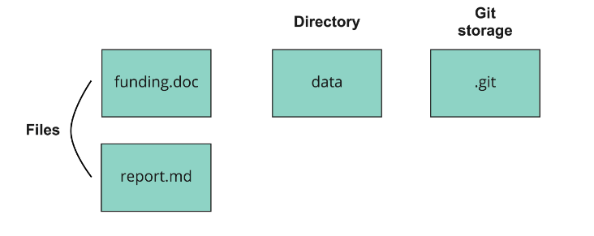
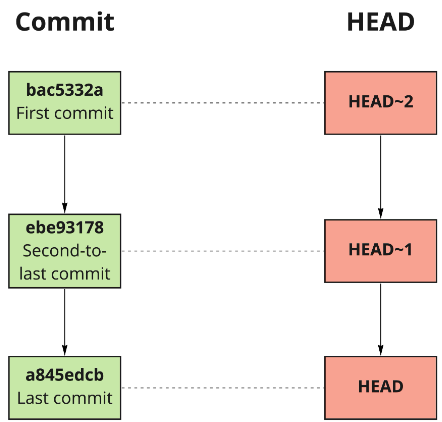

# <u> Git Documentations </u>
Most of the contents below are created with reference to DataCamp.

## <u> **Section 1: Introduction to Git** </u>

## **Section 1a: Introduction to Version Control with Git** 

### **What is a Version?**
1. Contents of a file at a given point in time.
1. Metadata (information associated with the file):

    - The author of the file.
    - Where it is located.
    - The file type.
   - When it was last saved.
<br/>
<br/>

### **What is Version Control?**
1. Version control is a group of systems and processes
    - To manage changes made to documents, programs, and directories.
2. Version control is useful for anything that: 
    - Changes over time, or
    - Needs to be share.
3. Reason to use version control:
    - Track files in different states.
    - Simultaneous file development. (Continuous Development)
    - Combine different versions of file.
    - Identify a particular version.
    - Revert changes.
<br/>
<br/>

### **Why is Version Control important?**
Version control is important **to keep track of changes, and keep every team member working on the right version**.\
Reference: [Link](https://www.perforce.com/blog/vcs/what-is-version-control#:~:text=version%20control%20works.-,Why%20Is%20Version%20Control%20Software%20Important%3F,team%20members%20will%20collaborate%20on.)
<br/>
<br/>

### **Git**
- Popular version control system for computer programming and data projects.
- Open source.
- Scalability, a measure of a system's ability to increase or decrease in performance and cost in response to changes in application and system processing demands.

** Take note that Git is not GitHub, but it is common to use Git with GitHub.
<br/>
<br/>

### **Benefits of Git**
The benefits of Git are as following:
- Git stores everything, so nothing is lost.
- Git notifies us when there is conflicting content in files.
- Git synchronizes across different people and computers.
<br/>
<br/>

### **How to use Git?**
- Git commands are run on the **shell**, also known as the *terminal*.
- The shell:
    - is a program for executing commands.
    - can be used to easily preview, modify, or inspect files and directories.
- Directory = Folder.
<br/>
<br/>

### **Useful shell commands**
Command 1: Print out working directory
```
pwd
```

Command 2: Print a list of all files in the directory.
```
ls
```

Command 3: Change directory.
```
cd
```

Command 4: Editing a file.
```
nano example.csv
```
- Use `nano` to:
    - delete.
    - add.
    - or change contents of a file.
- Save changes: `Ctrl + o` (Small letter **o**)
- Exit the text editor: `Ctrl + x` (Small letter **x**)

Command 4a (Alternative): Creating/Editing a file
```
echo
````
Example:
- Create a new file `todo.txt`
```
echo "Review for duplicate records" > todo.txt
```
- Add content to existing file `todo.txt`
```
echo "Review for duplicate records" >> todo.txt
```

### **Checking Git Version**
```
git --version
```
<br/>

----
<br/>

## **Section 1b: Saving Files**

### **What is a Repository?**
Using the figure below as an example:




Assuming that we are working on a project and referring to the figure above, we can split the projects into two parts: 
1. Part 1 - Files and Directory: 
    - Created and edited throughout the project.
    - In this case, files refer to `funding.doc` and `report.md`; directory refers to `data`.
2. Part 2 - Git Storage
    - Extra information that Git records about the project's history.

The combinations of Part 1 and Part 2 is called a **repository**, which often reffered to as repo. Git stores all of its extra information in a directory called `.git`, located in the main directory of the repo. 

NOTE: Do not edit `.git` !!!!
<br/>
<br/>

### **Staging and Commiting**
Staging Area
- Saving a draft

Commit Changes
- Save files/update the repo

### **Accessing the `.git` Directory**
`.git` is a **hidden directory**. **Hidden directory** is a directory not displayed to users, typically because it sotres information to enable programs to run.

To access the `.git` (Hidden Directory), we can add the dash-a flag. For example:
```
ls -a
```

### **Git Workflow**
The figure below is the visualization of Git Workflow.


Using the figure above as example:
1. Modification of `report.md` in the **Working Directory**.
2. Storage of five (5) copies of draft updates to the **Staging Area** as work is still in progress.
3. Second and fifth versions of the file in the **Staging Area** is commited/saved in the **`.git` Directory**.
4. With each commit/save, **`.git` Directory** is modified to reflect the state of repo.  

In summary, the git workflow is as following:
1. Modify a file.
2. Save the draft.
3. Commit the updated file.
4. Repeat.
<br/>
<br/>

### **Saving File**
Adding a single file.
```
git add file.txt
```

Adding all modified files.
```
git add .
```
- `.` = all files and directories in current location
<br/>
<br/>

### **Commit File**
```
git commit -m "Test.txt"
```
By adding `-m`, we can include a log message about our commit, placing it in quotes. Log message is important because: 
- Log message is useful for reference.
- Best practice = short and concise.
<br/>
<br/>
### **Check Files Status**
```
git status
```
<br/>

____
<br/>

## **Section 1c: Comparing Files**
### **Useful shell commands**
Command 1: Comparing an unstaged file with the last commit
```
git diff file.txt
```
Sample results:


Interpretation of results:\
--- a/ = First version, or the last one to be saved\
+++ b/ = Second version, or the one not added to the staging area\
@@...@@ = Locations of the changes (In this case, -1,5 one line was removed at line five)\
Lines starting with a minus symbol written in red = Removed lines\
Lines starting with a plus symbol written in green = Added lines
<br/>
<br/>

Command 2: Comparing a staged file with the last commit
```
git diff -r HEAD file.txt
```
By adding:\
`-r` = Indicate which particular revision of the file\
`HEAD` = Shortcut for the most recent commit

Note: 
- `git diff -r` won't work if it isn't followed by `HEAD`.
<br/>
<br/>

Command 3: Comparing all staged files with the last commit
```
git diff -r HEAD
```
<br/>

____
<br/>

## <u> **Section 2: Making Changes on Git** </u>
## **Section 2a: Storing Data with Git**

### **Git Commits & Commit Structure**
Git commits have **three** parts:
- **Commit**
    - Contains the metadata.
- **Tree**
    - Tracks the names and locations in the repo.
- **Blob**
    - Binary large object.
    - May contain data of any kind.
    - Compressed snapshot of a file's contents.

The following is the visualization of the commit structure: 


Interpretation:\
First Commit:
- Tree:
    - From the tree, there are a total of two files were modified.
- Blob: 
    - Showing the snapshot of the file content.

Second Commit:
- Tree:
    - From the tree, there are a total of three files and two files were modified. In this case, `mental_health_survey.csv` being edited and `summary_statistics.csv` being created.
- Blob:
    - `report.md` is not modified hence it linked back to the blob in the first commit. For the remaining files, changes have been made hence it refer to the blob in the second commit.

Last commit:
- Tree:
    - From the tree, `report.md` and `mental_health_survey.csv` are being modified. There are no changes made for `summary_statistics.csv`
- Blob:
    - `summary_statistics.csv refer back to the blob in the second commit as no changes being made. For the remaning files, changes have been made hence it refer to the blob in the last commit.
<br/>
<br/>

### **Git Log**
Git Log is a utility tool to review and read a history of everything that happens to be a repository.
```
git log
```
- Press `space` to show more recent commits.
- Press `q` to quit the log and return to the terminal.
<br/>
<br/>

### **Git Hash**
Git Hash is a unique key (**hash**) that is generated after taking in the content, which will be used to store in the Git database. 

**Hash** is a pseudo-random number generated using the hash function. **Hashes** allow data sharing between repos. If there are cases where two files are the same, then their hashes are the same. 

With **hashes**, Git will only needs to compare hashes instead of comparing with the entire files.
<br/>
<br/>

### **Finding Particular Commit**
```
#To view all the commits to find the relevant hash
git log 
```
Take note that we only need the first 6-8 characters of the `hash` to select the commit that we wanted.

To show the commit that we wanted: 
```
git show c27fa856
```
Output of `git show c27fa856`:

<br/>
<br/>
____
<br/>

## **Section 2b: Viewing Changes**
### **HEAD shortcut**

```
git diff -r HEAD
```
With the `HEAD` shortcut, we can compare staged files to the version in the last commit. Use the usage of tilde `~`, we will be able to pick a specific commit to compare versions, for example:
- `HEAD~1` = Second most recent commit
- `HEAD~2` = Commit before that

Take note that spaces shall not be used before or after the tilde `~`.

The following figure shows function of `HEAD` with tilde `~` :



We can also use HEAD with `git show`
```
git show HEAD~3
```
<br/>
<br/>

### **Compare Changes Between Two Commits**
From above, we have discuss about `git show` and `git diff`, and both are used at different occasions:
- `git show` is useful for viewing changes made in a particular commit.
- `git diff` compares changes between two commits.

For example:\
If we were to compare the fourth and third most recent commits, we can use
```
git diff 35f4b4d 186398f
```
*or*
```
git diff HEAD~3 HEAD~2
```
<br/>

### **Changes per Document by Line**
To check who made the last change to each line of a file, and when the change took place, we can use:
```
git annotate filename.txt
```
Example output:


<br/>
<br/>

### **Summary of Command**
| Command | Function |
| - | - |
| `git show HEAD~1` | Show what changed in the second most recent commit |
| `git diff 35f4b4d 186398f` | Show changes between two commits |
| `git diff HEAD~1 HEAD~2` | Show changes between two commits |
| `git annotate file` | Show line-by-line changes and associated metadata |
<br/>
____
<br/>

## **Section 2c: Undoing Changes Before Committing**
### **Unstaging a File**
To unstage a single file:
```
git reset HEAD filename.txt
```
To unstage all files:
```
git reset HEAD
```
<br/>


### **Undo Changes to Unstaged File**
To undo changes to a file in the repository:
```
git checkout -- filename.txt
```
- `checkout` means switching to a different version.
    - Defaults to the last commit.
- This means losing all changes made to the unstaged file **forever**.

To undo changes to all unstaged files:
```
git checkout .
```
- `.` refers to the current directory when used in a shell command.
- Undo changes to all unstaged files in the current directory and subdirectories.
- This command must be run in the main directory.
<br/>
<br/>

### **Unstaging and Undoing**
The example code for unstaging and undoing:
```
#Unstage
git reset HEAD

#Undo
git checkout . 

#Save repo
git add .

#Commit File
git commit -m "Remarks on Changes"
```
<br/>

____
<br/>

## **Section 2d: Restoring and Reverting**
### **Customizing Log Output**
`git log` is useful to find the commit we want to revert to. However, when the project scale is too large, it will be difficult to find the commit we wish to revert to. 

By using `-`, we can restrict the number of commits displayed as following:\
For example:  
If we want to show the three most recent commits:
```
git log -3
```
If we only look at the commit history of one file:
```
git log -3 filename.txt
```
If we want to restrict the log by date (For example, 2nd April 2022):
```
#The date shall be specified in the following format: 
#'Month Day Year' where
# Month = 3 Letter Abbreviation, Day = 2 Digits, Year = 4 Digits
git log --since='Apr 2 2022'
```
If we want commits between two dates (For example, 2nd till 11th April):
```
git log --since='Apr 2 2022' --until='Apr 11 2022'
```
<br/>

### **Restoring An Old Version Of A File**
Previously, we have learnt that the following code can be used to undo the changes:
```
git checkout -- filename.txt
```
However, if we were to revert to a version from a specific commit:
```
#Replace the "--" with a specific commit
git checkout dc9d8fac filename.txt
```
If the commit was the second to last commit, we can also use:
```
git checkout HEAD~1 filename.txt
```
<br/>
<br/>

### **Restoring A Repo To A Previous State**
To restore a repo to the previous state, we can:
```
git checkout dc9d8fac
```
Alternatively:
```
git checkout HEAD~1
```
<br/>

### **Cleaning A Repository**
Before cleaning the repository, it is wise to check what files are not being tracked:
```
git clean -n
```
Once we have determine which file to delete, we can use:
```
git clean -f
```
Take note that `-f` cannot be undone!!!
<br/>
<br/>

## <u>**Section 3: Git Workflow**</u>
## **Section 3a: Configuring Git**
Git has customizable settings to speed up or improve how we work.
### **Levels of Settings**
To check the level of settings, we can use:
```
git config --list
```
Example Output:


`user.email` and `user.name` are needed by some commands, so setting these saves time. Note that `user.email` and `user.name` are **global** settings.

Git has three levels of settings:
1. `--local`: settings for one specific project
2. `--global`: settings for all of our projects
3. `--system`: settings for every users on this computer

If we want to check the configurations in the global settings, we can use:
```
git config --global --list
```
<br/>

### **Changing Settings**
To change the global setting, we can use: 
```
git config --global setting value
```
- `setting` refer to the credential to be replaced
- `value` refer to the value of `setting`

For example:\
To change the email address to lim@gmail.com:
```
git config --global user.email lim@gmail.com
```
To change username to Lim Wz:
```
git config --global user.name 'Lim Wz'
```
Take note that, if we don't use `''` and the `user.name` has a space, Git would save `user.name` as `Lim`.
<br/>
<br/>

### **Using An Alias**
Alias can be set up through the global settings. Alias is typically used to shorten a command.

For example, to create an alias for commiting files by executing `ci`:
```
git config --global alias.ci 'commit -m`
```
Again, `''` is used so that Git processes characters after the space. After setting up the allias, files can now be commited by executing:
```
git ci
```
**IMPORATANT: Be careful not to overwrite exisiting commands!**
<br/>
<br/>

### **Tracking Aliases**
To track the list of aliases, we can use:
```
git config --global --list
```
Output format: `alias.aliasname=command`  
Example:


<br/>
<br/>

### **Ignoring Specific Files**
To ignore specific files, we can create a `.gitignore` file using nano:
```
nano .gitignore
```
Then, by specifying the file extensions or files, we can ignore that particular files.

For Example:


- `*` = Wildcard
- Commonly ignored files are: APIs, Credentials, System Files, Software Dependencies

<br/>

----
<br/>

## **Section 3b: Branches**

### **What are Branches?**
Git uses **branches** to systematically track multiple versions of files. In each branch: 
- Some files might be the same.
- Others might be different.
- Some may not exist at all.

The following figure is the visualization of branches. 


Each boxes in the figure is reffering to commit, and there are total of three branches, namely:
1. Main Branch:
    - Always at the top and it is the deafult name Git provides to the branch whenever a project is created.
2. Analysis Branch (Self Defined):
    - Branches where the data is being analysed.
3. Report Branch (Self Defined):
    - Initial state of the report branch will be identical to the second commit in the analysis branch.

From the figure, two more commits were made in the analysis branch before merging back to the second commit in the main branch; wherelse two more commits were made in the report branch before merging back to the third commit in the main branch.
<br/>
<br/>

### **Source and Destination**
When merging two branches:
- The commits are called parent commits.
- `source` refer to the branch that we want to merge **from**.
- `destination` refer to the branch that we want to merge **into**.

Using the branch visualization above as an example, when `Analysis` merged into `Main`: 
- `Analysis` = `source`
- `Main` = `destination`
<br/>
<br/>

### **Benefits of Branches**
The benefits of using branches:
- Avoiding endless subdirectories.
- Multiple users can work simultaneously.
- Everything is tracked.
<br/>
<br/>

### **Identifying Branches**
To find the branches exist within the project, we can use:
```
git branch
```
Example Output:


`*` = Current Branch
<br/>
<br/>

### **Creating New Branch**
To create a new branch, we can use:
```
git checkout -b branchname
```
<br/>

### **Difference Between Branches**
To check the difference between branches, we can use:
```
git diff branch1 branch2
```
Standard git diff output will be produce. 

<br/>

----
<br/>

## **Section 3c: Working With Branches**
### **Why Do We Switch Branches?**
It is common to switch branches when we are working on a project, the reasons are:
- It is common to work on different components of a project simultaneously.
- Branches allow us to keep making progress concurrently.
<br/>
<br/>

### **Why Do We Merge Branches?**
Let's think that the `Main` branch as the ground truth for a project and each branch is used for a specific task. Then, once the task is completed, the changes is merged back into `Main`. 
<br/>
<br/>

### **Merging Branches**
To merge branches, we can use:
```
git merge source destination
```
For example, to merge `summary-statistics` into `main`:
```
git merge summary-statistics main
```
Merge Output Interpretation:


- First Line = Commit Hashes
- Second Line = Type of Merge
- Third to Fifth Line = Number of Lines Changed
- Last Two Line = Files Modified

<br/>

___
<br/>

## **Section 3d: Handling Conflict**
Conflict occurs when a file in different branches has different contents that prevent them from automatically merging into a single version. 

For Example:  
The following figure shows the output when conflict occurs during merging:


Following the Git's advice, open the file to check the conflicts, using:
```
nano todo.txt
```
**`nan todo.txt`** Output:


Output Interpretation:
1. The first line starting with arrows pointing to the left and the word `HEAD` indicates that lines beneath it contain the file's contents in the latest commit of the current branch.
2. The line with equal signs referes to the center of the conflict. 
    - As the line of equal signs comes straight after the first line, it indicates that the lines beneath are part of the file version in the latest commit of the current branch. 
    - However, if the equal signs came after some content, this would mean the files have different content on the same lines in different branches.
3. The line with several arrows pointing to the right and the word `UPDATE` indicates additional content below that is in the update branch.

For this example, we can remove the line to solve the conflict.  

**IMPORTANT:**  
To reduce the chanes of having conflict, it is wise to:
1. Use each branch for a specific task.
2. Avoid editing a file in multiple branches. 

<br/>

___
<br/>

## <u>**Section 4: Collaborating with Git** </u>

## **Section 4a: Creating New Repo**
To create a new report, we can use:
```
#Create a new repo
git inti projectname

#Change directory to the repo
cd projectname

#Check the status
git status
```
Don't create a Git repo inside another Git repo as there will be two **`.git`** directories and Git will get confused about which directory it needs to update.

<br/>

____
<br/>

## **Section 4b: Working With Remotes**

### **What Is Remote Repo?**
Repo stores in our local system is called local repo and it is only available within the local system. What if we want to work/collaborate with other people?

Commonly, a remote repo is used for collaborative work/project. Remote repo is a repo stored in the cloud through an online repo hosting service such as GitHub.
<br/>
<br/>

### **Why Use Remote Repos?**
Benefits of remote repos:
- Everything is backed up.
- Collaboration, regardless of location.
<br/>
<br/>

### **Clone Local Repo**
To clone repo locally:
```
git clone path-to-projcet-directory
```
*or*  

To clone a repo locally and assigning a new name:
```
git clone path-to-project-directory new-repo-name
```
<br/>

### **Cloning Remote Repo**
Remote repos are stored in an online hosting service. e.g., GitHub, Bitbucket, or Gitlab.

If we have account:
- We can clone a remote repo on to our local computer.

```
git clone [URL]
```
<br/>

### **Identifying Remote Repo**
When we clone a repo, Git remembers where the original was. Git stores a remote **tag** in the new repo's configuration. 

If we are in a repo, we can list the names of its remotes using:
```
git remote
```
If we want more informations, such as the remotes URLs, we can add the `-v` flag.
```
git remote -v
```
<br/>

### **Creating A Remote**
When cloning, Git will automatically name the remote `origin`. However, if we were to create a new remote, we will need to specify `name` (the name to be assign to the remote repo) and `URL` (path to the directory).
```
git remote add name URL
```
**IMPORTANT: Defining remote anmes is useful for merging branches**
<br/>
<br/>

### **Collboration On Git Projects**
When several people are collaborating on a Git project, in practice, they will:
1. Assess the remote.
2. Work on files locally.
3. Save them.
4. Synchronize their changes between the remote and local repos. 

This means that the remote repo should be the source of truth for the project, where the latest versions of files that are not drafts can be located.
<br/>
<br/>

### **Fetching From Remote**
To fetch versions from the remote, we can:
```
git fetch NameOfRemote Branch
```
<br/>

### **Synchronizing Content**
After fetching the versions from remote, we can synchronize contents between the two repos by:
```
git merge NameOfRemote Branch
```
<br/>

### **Pulling From Remote**
`Remote` is often ahead of `local` repos. Hence, `fetch` and `merge` is a common workflow when working with `remote` repo.

However, Git simplifies this process for us.
```
git pull NameofRemote Branch
```
**IMPORTANT: It is important to save (commit) locally before pulling from a `remote`.**
<br/>
<br/>

### **Pushing To Remote**
Before pushing the content to the remote, we will need to commit the files first. Once the files are saved, we can use:
```
git push remote local_branch
```
Push into **`remote` from `local_branch`**.
<br/>
<br/>

### **Push/Pull Workflow**
The typical push/pull workflow is as follows:
1. Pull the remote into local repo.
2. Work on project locally.
3. Commiting changes occasionally.
4. Push the updated local repo to the remote.

**IMPORTANT: Do not attempt to push local to remote as it will result in large amount of conflicts.**
<br/>
<br/>